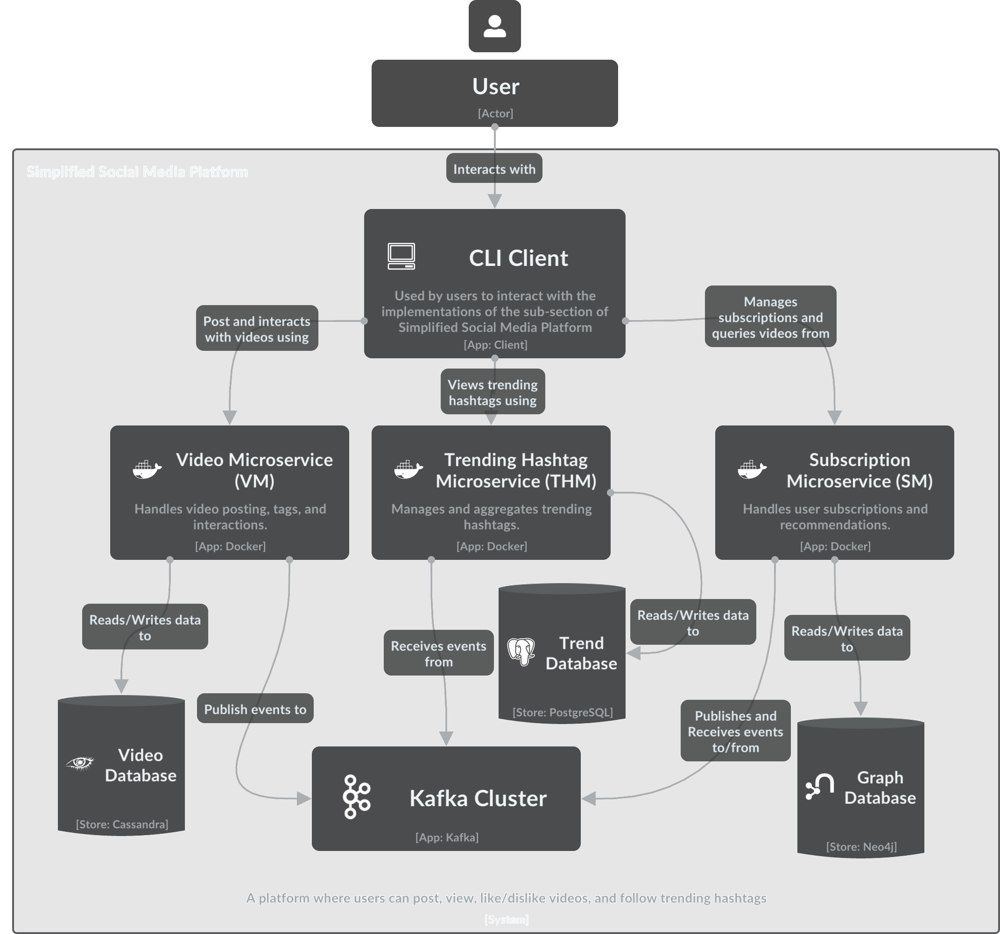

# Simplified Video Sharing Platform (Microservices Architecture)

## Overview

This project implements a simplified video-sharing platform inspired by popular social media apps (like TikTok). It is designed using a microservices architecture to ensure scalability, flexibility, and ease of maintenance. The platform includes services for managing videos, trending hashtags, and user subscriptions, each of which is independently scalable and deployable.

## Architecture



The platform is built on a microservices architecture, with the following key components:

### Microservices

1. **Video Microservice (VM)**  
   - **Purpose:** Manages video-related operations including posting, listing, watching, and engagement (likes/dislikes).
   - **Tech Stack:**  
     - **Framework:** Micronaut  
     - **Database:** Cassandra  
     - **Messaging Queue:** Kafka  
   - **Responsibilities:**  
     - Manages video data and metadata.  
     - Tracks user engagement and feedback on videos.  
     - Publishes events related to video interactions.

2. **Trending Hashtag Microservice (THM)**  
   - **Purpose:** Identifies and provides the top 10 liked hashtags within a specified time window.
   - **Tech Stack:**  
     - **Framework:** Micronaut  
     - **Database:** PostgreSQL  
     - **Data Streaming:** Kafka Streams  
   - **Responsibilities:**  
     - Aggregates likes per tag over a rolling time window.
     - Subscribes to VM events to dynamically update trending hashtags.

3. **Subscription Microservice (SM)**  
   - **Purpose:** Manages user subscriptions to hashtags and recommends videos based on these subscriptions.
   - **Tech Stack:**  
     - **Framework:** Micronaut  
     - **Database:** Neo4j  
     - **Messaging Queue:** Kafka  
   - **Responsibilities:**  
     - Manages user subscriptions/unsubscriptions to hashtags.  
     - Recommends videos based on user subscriptions and interactions.

### Event-Driven Communication

**Kafka** is used as the messaging queue to facilitate communication between microservices. Events like video posts, likes/dislikes, and subscriptions are published and consumed by the respective services.

### Database Technologies

- **Cassandra:** Used for storing video data and user interaction history.
- **PostgreSQL:** Used in the Trending Hashtag Microservice to store and query top hashtags.
- **Neo4j:** A graph database used in the Subscription Microservice for managing relationships between users and hashtags.

## Build and Deployment

### Prerequisites

Ensure you have the following tools installed:
- **Java 17**
- **Docker & Docker Compose**
- **Gradle**

### Building the Microservices

Navigate to each microservice directory and run the following commands:

```bash
./gradlew build
./gradlew jibDockerBuild
```

This will build the microservice and create a Docker image using Google Jib.

### Running the Application

Use Docker Compose to orchestrate the microservices and their dependencies. From the root directory of the project, run:

```bash
docker-compose up
```

This command will start all microservices along with their respective databases and Kafka.

## CLI Client

The platform includes a Command-line Interface (CLI) client for interacting with the microservices. Below are some common commands:

- **Post a Video:**  
  `cli post [-hV] [--verbose] -t=<title> -u=<userId> -T=<tags> [-T=<tags>]...`

- **Like a Video:**  
  `cli like-video [-hV] [--verbose] [-u=<userId>] [-v=<videoId>]`

- **Dislike a Video:**  
  `cli dislike-video [-hV] [--verbose] [-u=<userId>] [-v=<videoId>]`

- **Watch a Video:**  
  `cli watch-video [-hV] [--verbose] -u=<userId> -v=<videoId>`

- **Show Trending Hashtags:**  
  `cli current-top [-hV] [--verbose] [-l=<limit>]`

- **List Recommended Videos:**  
  `cli suggest-videos [-hV] [--verbose] [-t=<tagName>] -u=<userId>`

Run `cli --help` for a full list of commands and options.

## Modeling and Metamodel

### Metamodel Overview

This project incorporates a domain-specific modeling language (DSL) to define the architecture of the microservices system. The metamodel is designed to represent the following core components:

1. **Events:**  Represented by unique names and associated fields/types. Events are the foundational building blocks of the system's event-driven architecture.

2. **Event Streams:**  Linked to specific events, event streams manage the flow of data between microservices, ensuring that each service subscribes to the correct events.

3. **Microservices:**  Detailed representations of each service in the architecture, including its name, description, and communication patterns. Each microservice is connected to event streams for publishing and subscribing to events.

4. **API Resources:**  Defines the service interfaces, including HTTP methods, request/response formats, and paths. This ensures clear and precise API documentation and client integration.

5. **Containerization:**  Includes deployment and operational details, such as container technologies, environment configurations, and dependencies, crucial for the cloud-native deployment of microservices.

### Graphical Concrete Syntax

The graphical syntax for the metamodel was designed with the following principles:

- **Semiotic Clarity:**  Distinct graphical elements are used to represent different model components (e.g., Microservices, Events).

- **Perceptual Discriminability:**  Colors and shapes are assigned to different elements to aid in quick recognition and understanding.

- **Complexity Management:**  Tools like filters and layers are used to manage the complexity of the model, allowing focus on specific components without overwhelming the user.

### Model-to-Text Transformation

Epsilon Generation Language (EGL) is utilized to automatically generate parts of the codebase from the metamodel, ensuring consistency and reducing manual errors. Key transformations include:

1. **Microservice Scaffolding Generation:** Creates the foundational structure for each microservice, including directories and placeholder files.

2. **API Controllers Generation:** Generates Java controller classes based on the API resources defined in the model.

3. **Event Handling Code Generation:** Generates DTOs, Kafka listeners, and producers to handle event-driven communication between microservices.

4. **Health Controller and Test Generation:** Generates health check endpoints and corresponding test cases for each microservice.

5. **Docker Compose Configuration:** Automates the creation of `docker-compose.yml` files for orchestrating microservices deployment.

## Quality Assurance

- **Unit and Integration Testing:**  The microservices are tested with high code coverage using JaCoCo. Tests cover all critical paths and business logic.

- **System Testing:**  Comprehensive system testing ensures proper inter-service communication, data integrity, and system reliability.

- **Vulnerability Scanning:**  Docker images are scanned for vulnerabilities using Trivy and Docker Scout, ensuring a secure deployment.

## Future Work

- **Automated System Tests:**  Further automation of system tests to improve efficiency.

- **Load Testing:**  Conduct performance and load testing to assess system behavior under stress.

- **Kubernetes Integration:**  Consider integrating Kubernetes for advanced orchestration, auto-scaling, and self-healing capabilities.

## Conclusion

This project showcases a robust, scalable, and adaptable microservices architecture for a simplified video-sharing platform. With a strong focus on modularity and modern development practices, the platform is designed to grow and evolve with user demands.
